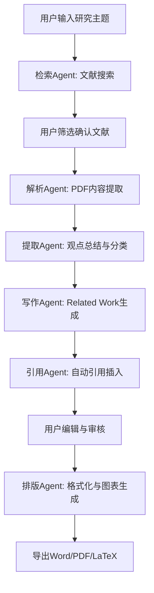

## 1. 产品概述

ResearchFlow 是一个面向大学生、大创项目团队、数学建模参赛者及科研工作者的专业级自动科研写作智能体平台。平台采用多智能体协作架构，实现从文献检索、PDF解析、观点提取、内容生成到文档导出的科研写作全流程自动化，区别于普通AI聊天工具，提供端到端的科研生产力解决方案。

- MVP阶段聚焦自动文献综述生成系统，解决科研工作者在Related Work撰写中的核心痛点
- 核心价值：基于真实文献与完整引用链的内容驱动生成，而非简单的AI文本拼接

## 2. 核心功能

### 2.1 用户角色

| 角色 | 注册方式 | 核心权限 |
|------|----------|----------|
| 普通用户 | 邮箱注册 | 使用文献检索、综述生成、文档导出等基础功能 |
| 高级用户 | 邀请码/付费升级 | 解锁批量文献处理、高级引用格式、长篇论文生成等高级功能 |

### 2.2 功能模块

1. **首页（工作台）**：项目列表、快速创建、最近任务、使用引导
2. **文献综述生成页**：主题输入、文献检索与筛选、内容生成与编辑、引用管理
3. **文献库页**：已检索文献管理、PDF预览、元数据编辑、收藏与分类
4. **文档导出页**：格式选择、排版预览、引用格式切换、一键导出

### 2.3 页面详情

| 页面名称 | 模块名称 | 功能描述 |
|----------|----------|----------|
| 首页（工作台） | Hero引导区 | 平台介绍、核心功能亮点展示、快速开始按钮 |
| 首页（工作台） | 项目列表 | 展示用户创建的科研项目卡片，含状态标签（进行中/已完成）、创建时间、主题摘要 |
| 首页（工作台） | 最近任务 | 右侧面板展示最近执行的生成任务及实时进度 |
| 文献综述生成页 | 主题输入区 | 支持关键词、论文题目、研究方向描述等多种输入方式，提供智能补全建议 |
| 文献综述生成页 | 文献检索面板 | 实时展示arXiv/Semantic Scholar/Crossref检索结果，支持筛选、排序、批量选择 |
| 文献综述生成页 | 多智能体工作流 | 可视化展示Agent协作流程：检索Agent→解析Agent→提取Agent→写作Agent→引用Agent |
| 文献综述生成页 | 内容编辑器 | 所见即所得编辑器，支持章节拖拽排序、内容手动修改、引用高亮标注 |
| 文献综述生成页 | 引用管理面板 | 侧边栏展示所有引用文献，支持BibTeX导入、格式切换、引用位置跳转 |
| 文献库页 | 文献列表 | 表格/卡片视图切换，支持按相关性、时间、引用量排序 |
| 文献库页 | PDF预览 | 内嵌PDF阅读器，支持高亮标注与关键段落提取 |
| 文献库页 | 文献详情 | 展示元数据（作者、年份、期刊、摘要、关键词）、引用关系图谱 |
| 文档导出页 | 格式选择 | 支持Word(.docx)、PDF、LaTeX(.tex)、Typst(.typ)格式导出 |
| 文档导出页 | 排版预览 | 实时预览导出文档的排版效果，支持引用格式切换（BibTeX/GB-T/APA/IEEE） |
| 文档导出页 | 图表插入 | 自动生成科研图表（如研究趋势图、方法分类图）并插入文档 |

## 3. 核心流程

用户输入研究主题 → 系统调用检索Agent搜索文献 → 用户筛选确认文献 → 解析Agent提取PDF内容 → 提取Agent总结核心观点 → 写作Agent生成Related Work章节 → 引用Agent自动插入规范引用 → 用户编辑审核 → 选择格式导出文档

## 4. 用户界面设计

### 4.1 设计风格

- **主色调**：深邃学术蓝 (#1B2A4A) + 智能荧光青 (#00E5C7) 作为强调色，传达专业与科技感
- **辅助色**：暖灰 (#F5F3EF) 作为背景，象牙白 (#FFFEF9) 作为卡片底色，营造学术纸张质感
- **按钮风格**：圆角矩形（8px），主按钮采用渐变填充，次按钮采用描边风格
- **字体**：标题使用 Noto Serif SC（学术衬线体），正文使用 Noto Sans SC（清晰无衬线体），代码/引用使用 JetBrains Mono
- **布局风格**：左侧固定导航 + 右侧内容区，卡片式布局，宽屏优先
- **图标风格**：线性图标（Lucide Icons），2px描边，与整体学术简洁风格一致
- **动效**：页面切换使用淡入滑动，卡片悬浮微抬升，Agent工作流节点脉冲动画，进度条流畅过渡

### 4.2 页面设计概览

| 页面名称 | 模块名称 | UI元素 |
|----------|----------|--------|
| 首页（工作台） | Hero引导区 | 深蓝渐变背景，大标题衬线字体，荧光青CTA按钮，浮动粒子动效 |
| 首页（工作台） | 项目列表 | 象牙白卡片网格，悬浮阴影抬升，状态标签彩色胶囊，创建时间灰色小字 |
| 首页（工作台） | 最近任务 | 右侧窄面板，进度条荧光青渐变，任务名截断显示，状态图标脉冲 |
| 文献综述生成页 | 主题输入区 | 居中大输入框，搜索图标前缀，下方热门主题标签云，输入时智能补全下拉 |
| 文献综述生成页 | 文献检索面板 | 左侧面板，文献卡片列表含缩略图+标题+作者+年份+引用量，勾选框批量选择 |
| 文献综述生成页 | 多智能体工作流 | 顶部水平流程条，节点圆形图标+标签，活跃节点脉冲发光，连线渐变流动 |
| 文献综述生成页 | 内容编辑器 | 中央主区域，类Notion块编辑器，引用标记荧光青高亮，章节标题可折叠 |
| 文献综述生成页 | 引用管理面板 | 右侧抽屉面板，文献条目紧凑列表，格式切换下拉，引用位置点击跳转 |
| 文献库页 | 文献列表 | 顶部工具栏（搜索+筛选+视图切换），卡片/表格双视图，排序下拉菜单 |
| 文献库页 | PDF预览 | 模态弹窗，内嵌PDF渲染，侧边高亮标注列表，提取按钮荧光青 |
| 文献库页 | 文献详情 | 侧滑面板，元数据结构化展示，引用关系力导向图 |
| 文档导出页 | 格式选择 | 四格式卡片横排，选中态荧光青边框+发光，格式图标+描述 |
| 文档导出页 | 排版预览 | 中央A4纸张模拟预览，缩放控制，引用格式切换标签页 |
| 文档导出页 | 图表插入 | 图表类型选择网格，预览缩略图，插入位置选择器 |

### 4.3 响应式设计

- 桌面优先设计，最小支持1280px宽度
- 平板端（768-1280px）：侧边栏折叠为汉堡菜单，双栏变单栏
- 移动端（<768px）：底部Tab导航，卡片全宽，编辑器简化工具栏

### 4.4 3D场景指引

不适用，本产品不涉及3D场景。
