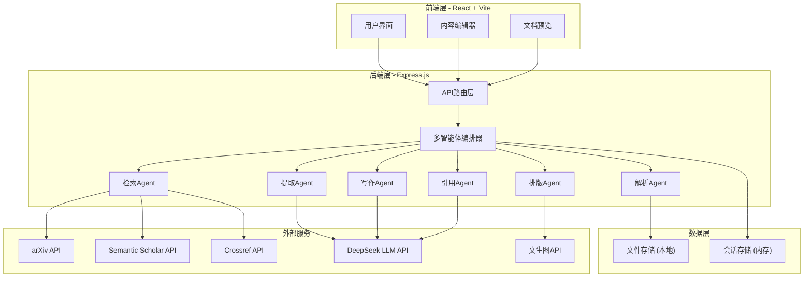
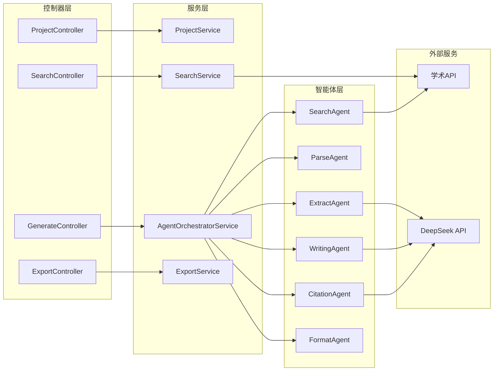
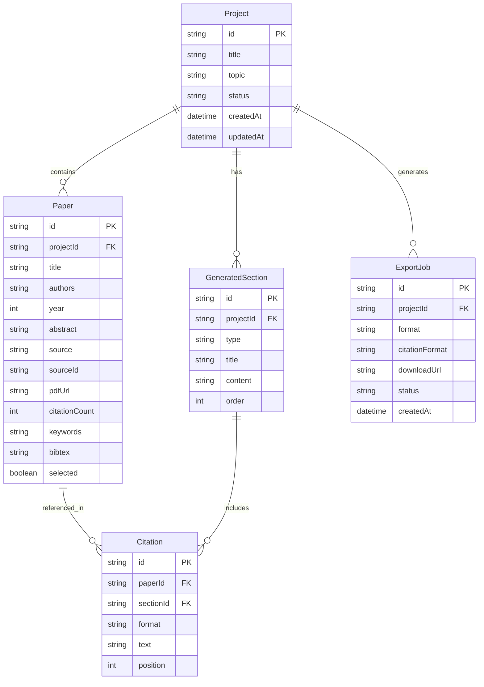

## 1. 架构设计



## 2. 技术说明

- **前端**：React@18 + TailwindCSS@3 + Vite + TypeScript
- **初始化工具**：Vite (create-vite)
- **后端**：Express@4 + TypeScript
- **数据库**：MVP阶段使用文件系统存储 + 内存会话管理，不引入数据库
- **LLM服务**：DeepSeek v4 Pro API（sk-2541c272e2ee4c619f88f1cf5d5435e5）
- **文生图服务**：流动硅基平台 Qwen/Qwen-Image-2.0（sk-zvpftbemmenqfllkyzvkoewfkwprqsufusznsgbsohadlmmt）
- **文献检索**：arXiv API、Semantic Scholar API、Crossref API
- **PDF解析**：pdf-parse（Node.js端）
- **文档导出**：docx（Word生成）、pdfkit（PDF生成）
- **状态管理**：Zustand
- **路由**：React Router v6
- **UI组件库**：Radix UI + TailwindCSS 自定义组件
- **编辑器**：TipTap（基于ProseMirror的块编辑器）
- **动画**：Framer Motion
- **图标**：Lucide React

## 3. 路由定义

| 路由 | 用途 |
|------|------|
| / | 首页/工作台，展示项目列表与快速操作 |
| /project/:id | 文献综述生成页，核心工作流界面 |
| /library | 文献库页，管理已检索文献 |
| /export/:id | 文档导出页，格式选择与预览导出 |

## 4. API定义

### 4.1 项目管理

```typescript
interface Project {
  id: string;
  title: string;
  topic: string;
  status: "draft" | "searching" | "parsing" | "generating" | "completed";
  createdAt: string;
  updatedAt: string;
}

// POST /api/projects - 创建项目
interface CreateProjectRequest {
  topic: string;
  title?: string;
}
interface CreateProjectResponse {
  project: Project;
}

// GET /api/projects - 获取项目列表
interface GetProjectsResponse {
  projects: Project[];
}

// GET /api/projects/:id - 获取项目详情
interface GetProjectResponse {
  project: Project;
  papers: Paper[];
  generatedContent: GeneratedSection[];
}
```

### 4.2 文献检索

```typescript
interface Paper {
  id: string;
  title: string;
  authors: string[];
  year: number;
  abstract: string;
  source: "arxiv" | "semantic_scholar" | "crossref";
  sourceId: string;
  pdfUrl?: string;
  citationCount?: number;
  keywords?: string[];
  bibtex?: string;
  selected: boolean;
}

// POST /api/search - 搜索文献
interface SearchPapersRequest {
  query: string;
  sources?: ("arxiv" | "semantic_scholar" | "crossref")[];
  maxResults?: number;
}
interface SearchPapersResponse {
  papers: Paper[];
  totalFound: number;
}

// POST /api/papers/select - 选择文献
interface SelectPapersRequest {
  projectId: string;
  paperIds: string[];
}
```

### 4.3 内容生成

```typescript
interface GeneratedSection {
  id: string;
  type: "introduction" | "related_work" | "methodology" | "conclusion";
  title: string;
  content: string;
  citations: Citation[];
  order: number;
}

interface Citation {
  id: string;
  paperId: string;
  format: "bibtex" | "gbt" | "apa" | "ieee";
  text: string;
  position: number;
}

// POST /api/generate/related-work - 生成Related Work
interface GenerateRelatedWorkRequest {
  projectId: string;
  paperIds: string[];
  citationFormat: "bibtex" | "gbt" | "apa" | "ieee";
}
interface GenerateRelatedWorkResponse {
  sections: GeneratedSection[];
  references: Reference[];
}

// WebSocket /ws/generate/:projectId - 生成进度流
interface GenerationProgress {
  stage: "searching" | "parsing" | "extracting" | "writing" | "citing" | "formatting";
  progress: number;
  message: string;
  partialContent?: string;
}
```

### 4.4 文档导出

```typescript
// POST /api/export - 导出文档
interface ExportDocumentRequest {
  projectId: string;
  format: "docx" | "pdf" | "latex" | "typst";
  citationFormat: "bibtex" | "gbt" | "apa" | "ieee";
  includeCharts: boolean;
}
interface ExportDocumentResponse {
  downloadUrl: string;
  fileName: string;
}
```

## 5. 服务端架构图



## 6. 数据模型

### 6.1 数据模型定义



### 6.2 数据定义

MVP阶段采用文件系统存储，数据以JSON格式保存：

```sql
-- 以下为逻辑模型，MVP阶段以JSON文件实现

CREATE TABLE projects (
    id VARCHAR(36) PRIMARY KEY,
    title VARCHAR(500) NOT NULL,
    topic TEXT NOT NULL,
    status ENUM('draft', 'searching', 'parsing', 'generating', 'completed') DEFAULT 'draft',
    created_at DATETIME DEFAULT CURRENT_TIMESTAMP,
    updated_at DATETIME DEFAULT CURRENT_TIMESTAMP ON UPDATE CURRENT_TIMESTAMP
);

CREATE TABLE papers (
    id VARCHAR(36) PRIMARY KEY,
    project_id VARCHAR(36) NOT NULL,
    title VARCHAR(1000) NOT NULL,
    authors TEXT,
    year INT,
    abstract TEXT,
    source ENUM('arxiv', 'semantic_scholar', 'crossref'),
    source_id VARCHAR(200),
    pdf_url VARCHAR(500),
    citation_count INT DEFAULT 0,
    keywords TEXT,
    bibtex TEXT,
    selected BOOLEAN DEFAULT FALSE,
    FOREIGN KEY (project_id) REFERENCES projects(id) ON DELETE CASCADE
);

CREATE TABLE generated_sections (
    id VARCHAR(36) PRIMARY KEY,
    project_id VARCHAR(36) NOT NULL,
    type ENUM('introduction', 'related_work', 'methodology', 'conclusion'),
    title VARCHAR(500),
    content TEXT,
    sort_order INT DEFAULT 0,
    FOREIGN KEY (project_id) REFERENCES projects(id) ON DELETE CASCADE
);

CREATE TABLE citations (
    id VARCHAR(36) PRIMARY KEY,
    paper_id VARCHAR(36) NOT NULL,
    section_id VARCHAR(36) NOT NULL,
    format ENUM('bibtex', 'gbt', 'apa', 'ieee'),
    text TEXT,
    position INT,
    FOREIGN KEY (paper_id) REFERENCES papers(id) ON DELETE CASCADE,
    FOREIGN KEY (section_id) REFERENCES generated_sections(id) ON DELETE CASCADE
);

CREATE TABLE export_jobs (
    id VARCHAR(36) PRIMARY KEY,
    project_id VARCHAR(36) NOT NULL,
    format ENUM('docx', 'pdf', 'latex', 'typst'),
    citation_format ENUM('bibtex', 'gbt', 'apa', 'ieee'),
    download_url VARCHAR(500),
    status ENUM('pending', 'processing', 'completed', 'failed') DEFAULT 'pending',
    created_at DATETIME DEFAULT CURRENT_TIMESTAMP,
    FOREIGN KEY (project_id) REFERENCES projects(id) ON DELETE CASCADE
);
```
